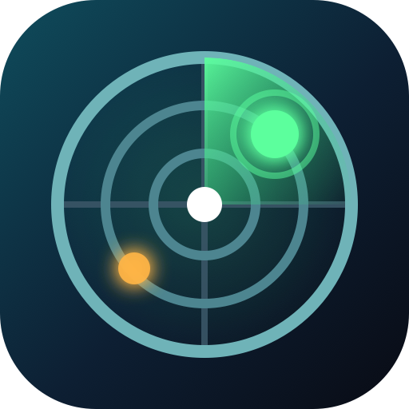

<p align="center">
  
</p>

<h1 align="center">Radar</h1>

<p align="center">
  <b>Takip hareketlerini izleyen Chrome eklentisi</b><br>
  <b>Chrome extension for tracking follow activity</b>
</p>

<p align="center">
  
  
  
  
</p>

<p align="center">
  <a href="#türkçe">Türkçe</a> · <a href="#english">English</a> · <a href="PRIVACY.md">Privacy</a> · <a href="CHANGELOG.md">Changelog</a>
</p>

---

## Türkçe

Radar, bir Instagram profilinin **takip ettiği** ve **takipçi** listelerini kaydeder; iki kayıt arasında kimi yeni takip ettiğini, kimi bıraktığını, kimin onu bıraktığını gösterir. Kendi hesabınız için de çalışır.

- **Sunucu yok, hesap yok.** Her şey tarayıcınızda (`chrome.storage.local`) kalır; hiçbir veri dışarı gönderilmez.
- **Sıfır bağımlılık.** Düz HTML/CSS/JS, Manifest V3.
- **TR / EN** arayüz (tarayıcı diline göre).

### Kurulum (geliştirici modu)

1. Bu depoyu indirin veya klonlayın.
2. Chrome'da `chrome://extensions` → sağ üstten **Geliştirici modu**'nu açın.
3. **Paketlenmemiş öğe yükle** → `radar-ext` klasörünü seçin.

### Kullanım

1. instagram.com'da giriş yapın, izlemek istediğiniz profili açın (`instagram.com/kullaniciadi`).
2. Araç çubuğundaki Radar simgesine tıklayın → **Snapshot al**. Liste boyutuna göre birkaç saniye ile birkaç dakika sürer.
3. Bir gün sonra aynı profilde tekrarlayın. **Paneli aç** ile farkı görün.

Ana sayfada (`instagram.com/`) çalıştırırsanız kendi hesabınız kaydedilir.

### Bilmeniz gerekenler

- Eklenti, Instagram web istemcisinin kendi kullandığı dahili uç noktaları çağırır. Bu, Instagram Kullanım Şartları'nın otomatik veri toplama maddesiyle çelişir. **Kullanım riski size aittir.** İstekler arasına 2–4 saniye bekleme konur ve aynı hesap için 20 saat içinde ikinci bir snapshot alınmak istenirse uyarı verilir.
- Gizli bir hesabın listesi yalnızca onu takip ediyorsanız çekilebilir (uygulamadaki kuralla aynı).
- Snapshot'lar yalnızca bu tarayıcı profilinde durur. Panelden **Yedek al** ile JSON dışa aktarıp başka bir tarayıcıda **Yedek yükle** ile geri alabilirsiniz.

### Proje yapısı

```
manifest.json        MV3 manifest
content.js           instagram.com üzerinde çalışır; listeleri çeker, storage'a yazar
popup.html/.js       araç çubuğu popup'ı: hedef, snapshot butonu, ilerleme
panel.html/.js       tam sayfa panel: hesap seçimi, snapshot karşılaştırma, listeler
_locales/{tr,en}/    arayüz metinleri
icons/               logo.svg kaynak + PNG'ler
```

Snapshot biçimi:

```json
{ "kind": "radar-snapshot", "version": 2, "takenAt": "ISO-8601",
  "target": { "id": "…", "username": "…", "full_name": "" },
  "expected": { "followers": 142, "following": 143 },
  "incomplete": false,
  "followers": [{ "id": "…", "username": "…", "full_name": "…" }],
  "following": [ … ] }
```

### Katkı

Issue ve PR'lara açığız. Kod yorumları TR + EN olarak tutulur; yeni arayüz metinleri her iki `_locales` dosyasına da eklenmelidir. Gizlilik: [PRIVACY.md](PRIVACY.md).

### Lisans

Kaynak kodu **[PolyForm Noncommercial 1.0.0](LICENSE)** lisansıyla yayımlanır:

- Kişisel, eğitim, araştırma ve ticari olmayan projelerde **serbestçe kullanabilir, değiştirebilir ve dağıtabilirsiniz**.
- **Ticari kullanım hakkı proje sahibine (Batuhan Haymana) aittir.** Ticari bir ürün, hizmet veya kâr amaçlı projede kullanmak için ayrıca izin/lisans almanız gerekir; iletişim için Issues bölümünü kullanın.
- Dağıtırken telif bildirimini ve bu lisansı korumalısınız.

---

## English

Radar saves an Instagram profile's **following** and **follower** lists and shows what changed between two snapshots: who they started following, who they unfollowed, who stopped following them. Works for your own account as well.

- **No server, no account.** Everything stays in your browser (`chrome.storage.local`); nothing is ever sent anywhere.
- **Zero dependencies.** Plain HTML/CSS/JS, Manifest V3.
- **TR / EN** UI (follows the browser language).

### Install (developer mode)

1. Download or clone this repository.
2. In Chrome open `chrome://extensions` → enable **Developer mode** (top right).
3. **Load unpacked** → select the `radar-ext` folder.

### Usage

1. Log in on instagram.com and open the profile you want to track (`instagram.com/username`).
2. Click the Radar icon in the toolbar → **Take snapshot**. Takes seconds to a few minutes depending on list size.
3. Repeat a day later on the same profile. **Open panel** to see the diff.

Running it on the home feed (`instagram.com/`) snapshots your own account.

### Things to know

- The extension calls the same internal endpoints Instagram's own web client uses. This conflicts with the automated-collection clause of Instagram's Terms of Use. **Use at your own risk.** Requests are spaced 2–4 s apart, and you're warned before taking a second snapshot of the same account within 20 hours.
- A private account's lists can only be fetched if you follow it (same rule as in the app).
- Snapshots live only in this browser profile. Use **Back up** in the panel to export JSON and **Restore** to import it elsewhere.

### Project layout

```
manifest.json        MV3 manifest
content.js           runs on instagram.com; fetches lists, writes to storage
popup.html/.js       toolbar popup: target, snapshot button, progress
panel.html/.js       full-page panel: account picker, snapshot compare, lists
_locales/{tr,en}/    UI strings
icons/               logo.svg source + PNGs
```

Snapshot format: see the JSON block in the Turkish section above (identical).

### Contributing

Issues and PRs welcome. Code comments are kept in TR + EN; any new UI string must be added to both `_locales` files. Privacy: [PRIVACY.md](PRIVACY.md).

### License

The source is released under **[PolyForm Noncommercial 1.0.0](LICENSE)**:

- You may **freely use, modify and distribute** it in personal, educational, research and other noncommercial projects.
- **Commercial rights are reserved by the project owner (Batuhan Haymana).** Using it in a commercial product, service or for-profit project requires a separate license; reach out via Issues.
- Keep the copyright notice and this license when redistributing.
